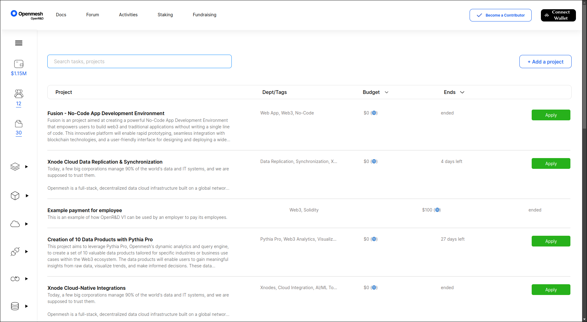
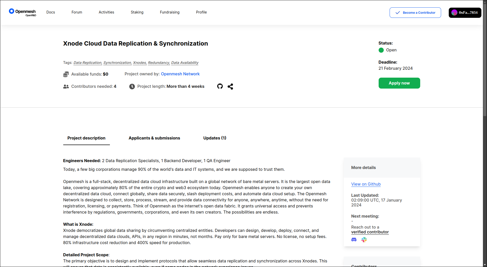

# OpenR&D Frontend

The UI for the Openmesh OpenR&D platform.
Used to manage projects, payouts, and disputes using smart contracts and ERC-20 tokens all with no KYC.

See it in action at [openrd.openmesh.network](https://openrd.openmesh.network).

Please report any bugs on issues page.

Check out the smart contract backend [here](https://github.com/openmesh-network/openrd-contracts).
Check out the Web2 backend [here](https://github.com/bruno353/dpl-backend). <!-- Change to openmesh-network -->

## Screenshots

